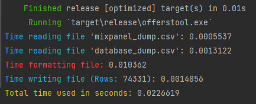

# PC

**CPU**: AMD Ryzen 7 5800X 3.80 GHz 
**Motherboard**: ASUS TUF Gaming X570-Plus 
**SSD**: AORUS NVMe Gen4 M.2 1TB 
**RAM**: Corsair DDR4 32GB 3200 MHZ CL16 
**SO**: Windows 10 Pro

 

------------------------------------------------------------------------------------------

# Goals
- [x] Show that **Rust is much better than js/ts** and can help us.
- [ ] Start **implementing Rust** in our work pipeline.

 

------------------------------------------------------------------------------------------

# RUST

### Perks
1. It is made to be used as a **cli tool**. ./offerstool -h in console to see the application information. You can enter the names of the three files or not put any and use the hardcoded default names.
2. **Remove duplicate** user_ids in files to make the report.
3. In case an error occurs (**something unlikely because it is Rust**), the error is handled by launching a panic and closing the program with an error message. It could have been specified where the error is, but it has not been done due to the use that will be given to the tool.
4. **23** code lines (core).
  

| Action | Seconds | Milliseconds |
| :---: | :---: | :---: |
| Time reading file mixpanel_dump.csv | 0.0005537s | 0.5537ms |
| Time reading file database_dump.csv | 0.0013122s | 1.3122ms |
| Time formatting file | 0.010362s | 10.362ms |
| Time writing file output.csv | 0.0014856s | 1.4856ms |
| Total time used | 0.0226619s | 22.6619ms |

 

 

------------------------------------------------------------------------------------------

# JS

### Perks
1. It is intended to be used by running the code, **not cli tool**.
2. **Remove duplicate** user_ids in files to make the report.
3. In case an error occurs (**something very likely because it is Javascript**), the error is handle with a try-catch block.
4. **27** code lines (core).
  

| Action | Seconds | Milliseconds |
| :---: | :---: | :---: |
| Time reading file mixpanel_dump.csv | 0.013s | 13ms |
| Time reading file database_dump.csv | 0.025s | 25ms |
| Time formatting file | 0.065s | 65ms |
| Time writing file output.csv | 0.003s | 3ms |
| Total time used | 0.113s | 113ms |

 

 

------------------------------------------------------------------------------------------

# SUMMARY

- Rust reads files about **ten times** faster 
- Rust writes files about **three times** faster 
- Most of the time is spent **searching** common user_ids and formatting report data 
- Rust is about **five times faster** than js at manipulating data in this case 
- **No sorting or search algorithms** have been used, only what the language brings 
  
